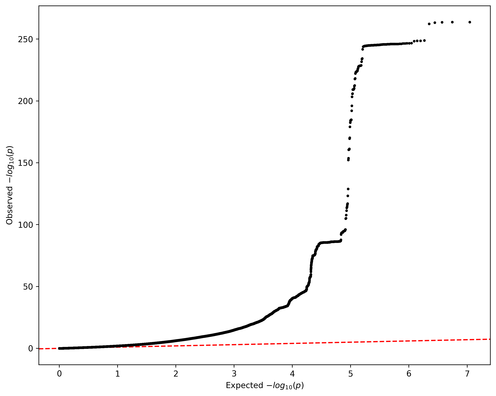
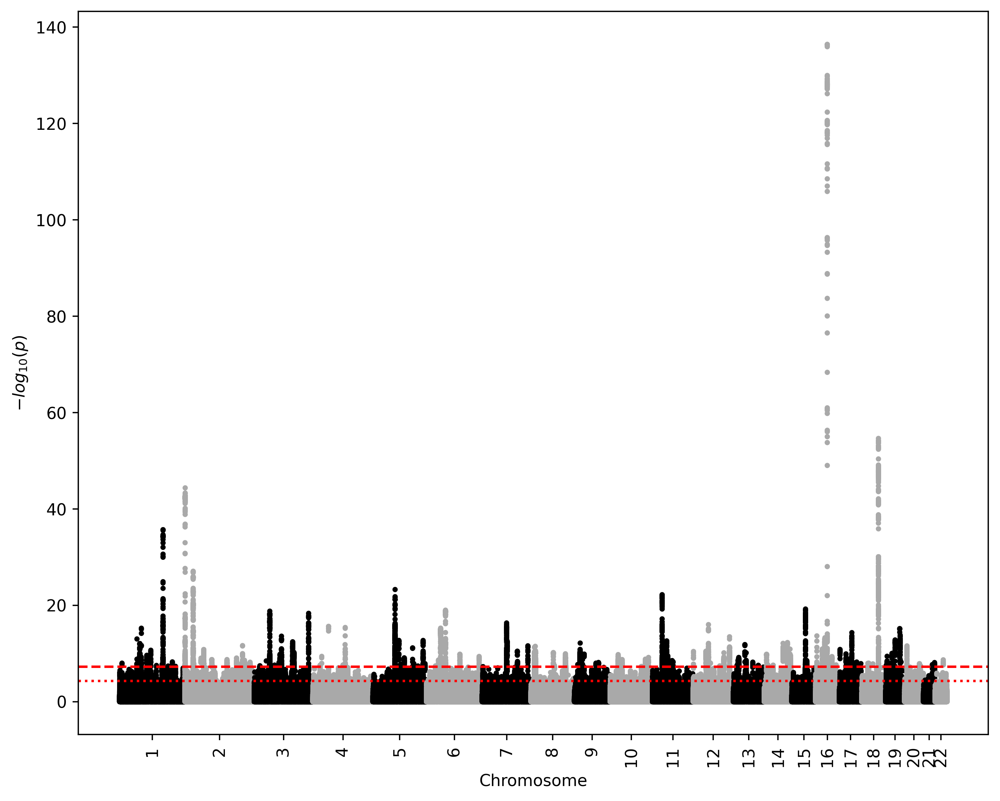
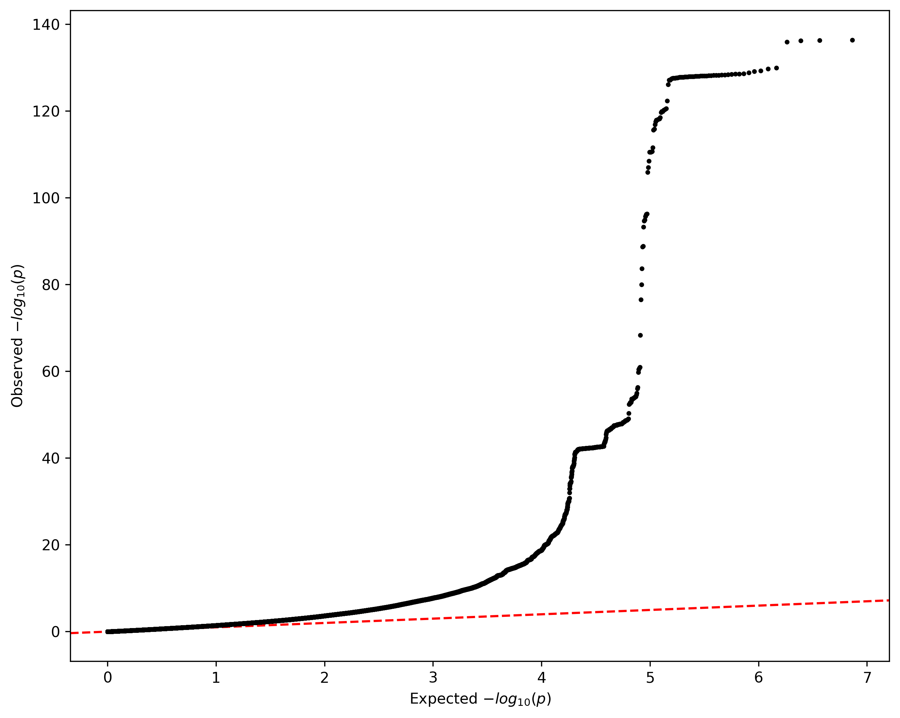

# Visualizing results

## Generate plots

Once our GWAS is complete, we can analyze the summary statistics obtained. Specifically, we want to create a [Manhattan plot](https://www.sciencedirect.com/topics/biochemistry-genetics-and-molecular-biology/manhattan-plot) and a [QQ plot](https://jnmaloof.github.io/BIS180L_web/slides/11_QQPlots.html#1).

The following code will do just that, although you can use any other software to obtain such plots.

```python
""" Generate Manhattan plot and QQ plot from GWAS summary statistics. """

import numpy as np
import matplotlib.pyplot as plt

# Input
PHENOTYPE = "BMI"
SOFTWARE = 'p' # for PLINK2 or 'r' for regenie

def read_results(phenotype, software):
    """ Parse GWAS result file and get values.

    Parameters
    ----------
    phenotype : str
        phenotype name.
    software : str { 'p', 'r'}
        Either 'p' for PLINK2 or 'r' for regenie,
        to correctly format the file.

    Returns
    -------
    list
        Chromosome numbers.
    list
        Transformed p-values (-log10).
    """
    chroms = []
    pvals = []

    # Software specific format.
    if software == 'p':
        line_start = "#"
        chrom_name = "#CHROM"
        p_name = "P"
        filename = "sumstat_${phenotype}.ADD"
    elif software == 'r':
        line_start = "C"
        chrom_name = "CHROM"
        p_name = "LOG10P"
        filename = "sumstat_${phenotype}.regenie"

    with open(filename, 'r') as glm:
        for line in glm:
            columns = line.split()
            if line.startswith(line_start):
                chrom_id = columns.index(chrom_name)
                p_id = columns.index(p_name)
            else:
                chroms.append(int(columns[chrom_id]))
                if software == 'p':
                    pvals.append(-np.log10(float(columns[p_id])))
                elif software == 'r':
                    pvals.append(float(columns[p_id]))

    return chroms, pvals

def manhattan_plot(chroms, pvals, phenotype, software):
    """ Generate Manhattan plot.

    Parameters
    ----------
    chroms : list
        Chromosome numbers.
    pvals : list
        Transformed p-values (-log10).
    phenotype : str
        phenotype name.
    software : str { 'p', 'r'}
        Either 'p' for PLINK2 or 'r' for regenie,
        to correctly format the file.

    Returns
    -------
    img
        Manhattan plot.
    """
    chrom_distrib = {}
    colors = []
    for chrom in chroms:
        chrom_number = chrom
        # Specify color
        if chrom_number%2 == 0:
            colors.append("darkgray")
        else:
            colors.append("black")

        # Track chromosome number
        if chrom_number not in chrom_distrib:
            chrom_distrib[chrom_number] = 1
        else:
            chrom_distrib[chrom_number] += 1

    # Plot
    plt.figure(figsize=(10, 8), dpi=330)
    plt.scatter(range(len(chroms)), pvals, color=colors, s=5)

    # Correct x axis
    istart = 0
    iend = 0
    x_ticks = []
    x_labels = []
    for chrom, number in chrom_distrib.items():
        # Update end idx
        iend += number

        pos = (istart + iend - 1) / 2
        x_ticks.append(pos)
        x_labels.append(chrom)

        # Update start idx
        istart = iend

    # Plot suggestive and significative thresholds
    plt.axhline(-np.log10(5e-5), linestyle="dotted", color="red")
    plt.axhline(-np.log10(5e-8), linestyle="dashed", color="red")

    # Plot info
    plt.xticks(ticks=x_ticks, labels=x_labels, rotation=90)
    plt.xlabel("Chromosome")
    plt.ylabel("$-log_{10}(p)$")

    # Save
    if software == 'p':
        output = f"plink_{phenotype}_Manhattan_plot.png"
    elif software == 'r':
        output = f"regenie_{phenotype}_Manhattan_plot.png"
    plt.savefig(output, bbox_inches="tight")
    plt.close()

def qq_plot(pvals, phenotype, software):
    """ Generate QQ plot.

    Parameters
    ----------
    pvals : list
        Transformed p-values (-log10).
    phenotype : str
        phenotype name.
    software : str { 'p', 'r'}
        Either 'p' for PLINK2 or 'r' for regenie,
        to correctly format the file.

    Returns
    -------
    img
        QQ plot.
    """
    # Sort p-values
    pvals.sort(reverse=True)

    # Expected values
    n = len(pvals)
    exp = -np.log10((np.arange(n, dtype=float) - 0.5) / n)

    # Plot
    plt.figure(figsize=(10, 8), dpi=330)
    plt.axline((0, 0), slope=1, color="red", linestyle="dashed", zorder=0)
    plt.scatter(exp, pvals, color="black", s=5, zorder=10)
    plt.xlabel("Expected $-log_{10}(p)$")
    plt.ylabel("Observed $-log_{10}(p)$")

    # Save
    if software == 'p':
        output = f"plink_{phenotype}_QQ_plot.png"
    elif software == 'r':
        output = f"regenie_{phenotype}_QQ_plot.png"
    plt.savefig(output, bbox_inches="tight")
    plt.close()

# Read values
CHROMS, PVALS = read_results(PHENOTYPE, SOFTWARE)

# Manhattan Plot
manhattan_plot(CHROMS, PVALS, PHENOTYPE, SOFTWARE)
# QQ plot
qq_plot(PVALS, PHENOTYPE, SOFTWARE)
```

This command outputs 2 files:

* `<software>_BMI_Manhattan_plot.png` contains the Manhattan plot for the whole GWAS
* `<software>_BMI_QQ_plot.png` contains the QQ plot for the whole GWAS

> Since there is quite a lot of value to go through, this step can take a while. It should last about 35 minutes.

## Expected plots

### PLINK2

By the end of this tutorial, when using PLINK2, you should obtain the following Manhattan plot:


And the following QQ plot:



### regenie

By the end of this tutorial, when using regenie, you should obtain the following Manhattan plot:



And the following QQ plot:


